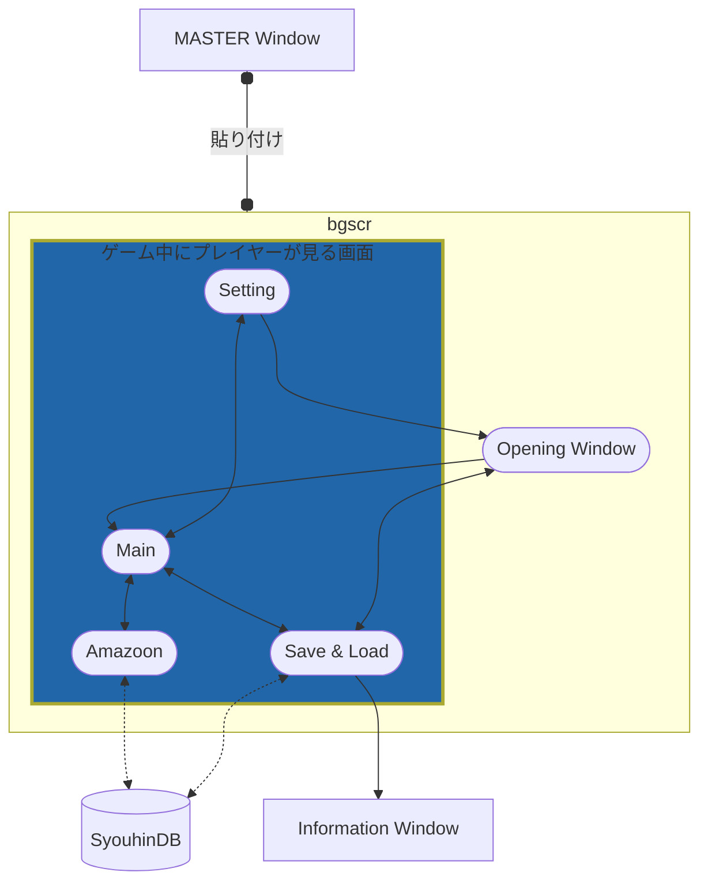

# PC Careing Diary
PC（自作パソコン）を作って育成していく育成･放置系ゲームです。色々制作中。
This is an idle desktop game where you build and upgrade your PC.
It's still under development.

個人制作であると同時に、リポジトリの練習も兼ねています。
In this repository, I practice the repository itself while publishing my personal work.
 

## 現在の仕様

画面遷移

## ファイルについて

スクリプトファイルの説明

 

* 00_module.hsp
	- ユーザー定義命令･関数、一部のWin32API定数のマクロ登録、その他外部から導入したモジュールなどをまとめたファイル.
 

* 01_variable.hsp
	- 以下のスクリプト内で使用するほぼ全ての変数をここで定義･管理しています.
	- また、ゲーム内で扱うアイテム類のデータをDBファイルから取り出す処理も行っています.
	- ウィンドウIDに関してはマクロ名定数列挙にてこちらで管理.
 

* 02_interface.hsp
	- ボタンやリストビュー、ハイパーリンクといったウィンドウオブジェクトをまとめています.
	- 同時に必要なウィンドウメッセージ、及び各種割り込み設定もこちらで扱っています.
 

* 03_process01.hsp
	- メインループの他、上記 02_interfaceからのルーチンジャンプ後の処理は原則全てこちらで扱っています.
 

* 04_process02.hsp
	- 描画に関するルーチンジャンプ処理のみこちらで管理しています.
	- また、SQLの処理部もこちらで扱う予定です.
 

* 05, 06, 07 拡張用のため欠番
 

* 08_experiment.hsp
	- 上記のスクリプトに変更を加える前にこちらで、加える変更箇所の動作確認や部分的な仮構築などを行います.
	- その他、思いつきや実験的な取り組みなどが中心でプロジェクトとはさほど関係ありません.
 

* changelog.html
	- 更新履歴です. ゲーム内で表示可能

以下略.

## その他

### 動作環境
* 動作には **WebView2Loader.dllが必要** です。 **同梱しておりません** のでご了承ください。

### 使用言語 (Codeing Language)

- [Hot Soup Processor (HSP3)](https://hsp.tv/)
- [SQLite](https://www.sqlite.org)

### 開発環境 (Development Environment)
- Windows11 Pro 22H2 x64
- Visual Studio Code
- HSP3.7beta3

 

# Licence
 

* hsp37beta/common/
	* user32.as
	* gdi32.as
	* hsp3util.as
	* hspda.as
	* hsedsdk.as
<!--  -->
* hspcmp.dll
* hspda.dll

### Hot Soup Processor (HSP)
Copyright (C) 1997-2021, Onion Software/onitama, all rights reserved.
Made with base technology of OpenHSP.

### OpenHSP
Copyright (C) 1997-2021, Onion Software/onitama.
All rights reserved.

Redistribution and use in source and binary forms, with or without modification, are permitted provided that the following conditions are met:

Redistributions of source code must retain the above copyright notice, this list of conditions and the following disclaimer.

Redistributions in binary form must reproduce the above copyright notice, this list of conditions and the following disclaimer in the documentation and/or other materials provided with the distribution.

Neither the name of the Onion Software nor the names of its contributors may be used to endorse or promote products derived from this software without specific prior written permission.

THIS SOFTWARE IS PROVIDED BY THE COPYRIGHT HOLDERS AND CONTRIBUTORS "AS IS" AND ANY EXPRESS OR IMPLIED WARRANTIES, INCLUDING, BUT NOT LIMITED TO, THE IMPLIED WARRANTIES OF MERCHANTABILITY AND FITNESS FOR A PARTICULAR PURPOSE ARE DISCLAIMED. IN NO EVENT SHALL THE COPYRIGHT OWNER OR CONTRIBUTORS BE LIABLE FOR ANY DIRECT, INDIRECT, INCIDENTAL, SPECIAL, EXEMPLARY, OR CONSEQUENTIAL DAMAGES (INCLUDING, BUT NOT LIMITED TO, PROCUREMENT OF SUBSTITUTE GOODS OR SERVICES; LOSS OF USE, DATA, OR PROFITS; OR BUSINESS INTERRUPTION) HOWEVER CAUSED AND ON ANY THEORY OF LIABILITY, WHETHER IN CONTRACT, STRICT LIABILITY, OR TORT (INCLUDING NEGLIGENCE OR OTHERWISE) ARISING IN ANY WAY OUT OF THE USE OF THIS SOFTWARE, EVEN IF ADVISED OF THE POSSIBILITY OF SUCH DAMAGE.

ソースコード形式かバイナリ形式か、変更するかしないかを問わず、以下の条件を満たす場合に限り、再頒布および使用が許可されます。

ソースコードを再頒布する場合、上記の著作権表示、本条件一覧、および下記免責条項を含めること。
バイナリ形式で再頒布する場合、頒布物に付属のドキュメント等の資料に、上記の著作権表示、本条件一覧、および下記免責条項を含めること。
書面による特別の許可なしに、本ソフトウェアから派生した製品の宣伝または販売促進に、Onion Softwareの名前またはコントリビューターの名前を使用してはならない。

本ソフトウェアは、著作権者およびコントリビューターによって「現状のまま」提供されており、明示黙示を問わず、商業的な使用可能性、および特定の目的に対する適合性に関する暗黙の保証も含め、またそれに限定されない、いかなる保証もありません。著作権者もコントリビューターも、事由のいかんを問わず、 損害発生の原因いかんを問わず、かつ責任の根拠が契約であるか厳格責任であるか（過失その他の）不法行為であるかを問わず、仮にそのような損害が発生する可能性を知らされていたとしても、本ソフトウェアの使用によって発生した（代替品または代用サービスの調達、使用の喪失、データの喪失、利益の喪失、業務の中断も含め、またそれに限定されない）直接損害、間接損害、偶発的な損害、特別損害、懲罰的損害、または結果損害について、一切責任を負わないものとします。
***
 
 

* hsp37beta/common/
	* sqlele.hsp
* sqlite3.dll

## SQLite & SQlele
All of the code and documentation in SQLite has been dedicated to the public domain by the authors.

Anyone is free to copy, modify, publish, use, compile, sell, or distribute the original SQLite code, either in source code form or as a compiled binary, for any purpose, commercial or non-commercial, and by any means.

>*ソース、コード形式またはコンパイルされたバイナリとして、目的、商用または非商用、手段を問わず、誰でもオリジナルの SQLiteコードを自由にコピー、変更、公開、使用、コンパイル、販売、配布することができます。*

 

* [SQLite HP URL](https://www.sqlite.org)
SQLite はパブリックドメインです。

* [SQlele URL](http://spn.php.xdomain.jp/hsp_sqlele.htm)
SQlele はHSP3でSQLiteを扱えるようにするための支援モジュールです。

***
 
 

* hsp37beta/common/
	* 00_module.hsp
<!--  -->
* text/
	* changelog.html
	* 08_ver000ex.txt
	* README.html
<!--  -->
* 01_variable.hsp
* 02_interface.hsp
* 03_process01.hsp
* 04_process02.hsp
* 08_experiment.hsp
* 08_ver020ex.exe
* PC Careing Diary.exe
* README.md

## MIT License
Copyright (c) 2022 YUZURANIUM

Permission is hereby granted, free of charge, to any person obtaining a copy
of this software and associated documentation files (the "Software"), to deal
in the Software without restriction, including without limitation the rights
to use, copy, modify, merge, publish, distribute, sublicense, and/or sell
copies of the Software, and to permit persons to whom the Software is
furnished to do so, subject to the following conditions:

The above copyright notice and this permission notice shall be included in all
copies or substantial portions of the Software.

THE SOFTWARE IS PROVIDED "AS IS", WITHOUT WARRANTY OF ANY KIND, EXPRESS OR
IMPLIED, INCLUDING BUT NOT LIMITED TO THE WARRANTIES OF MERCHANTABILITY,
FITNESS FOR A PARTICULAR PURPOSE AND NONINFRINGEMENT. IN NO EVENT SHALL THE
AUTHORS OR COPYRIGHT HOLDERS BE LIABLE FOR ANY CLAIM, DAMAGES OR OTHER
LIABILITY, WHETHER IN AN ACTION OF CONTRACT, TORT OR OTHERWISE, ARISING FROM,
OUT OF OR IN CONNECTION WITH THE SOFTWARE OR THE USE OR OTHER DEALINGS IN THE
SOFTWARE.

***
 
 

* hsp37beta/common/
	* webview2_10115038.hsp

## THANKS
webview2_10115038 はHSP3でWebView2を扱えるようにするための支援モジュールです。
* Author : eller様
* [HSPメモ帳](https://blog.goo.ne.jp/hiro239415)

 
 

***

## 更新履歴
## ver 0.2.0 &nbsp;_(2022/10/23)_
* ### 修正
	* メインループの動作中、各ウィンドウオブジェクトがちらつく不具合の修正.

* ### 変更
	* 設定画面,お店画面,をそれぞれメインウィンドウから独立させ、bgscr命令での初期化とした.
	* 各ウィンドウをMasterウィンドウに貼り付けるためメニューバーを廃止
	* ウィンドウオブジェクトが激しくちらつく原因の一つとしてredraw命令であったことが確認できたため同命令を廃止. レイヤーオブジェクトによる画面更新は直接整数を渡すことで対応.
	* ファイル名の変更.
	* 情報ウィンドウに表示する09_changelogを.txt形式から.html形式に変更した.
	* セーブデータにログを含めるようにした.
	* セーブとロードをダイアログを使用せずに独自のウィンドウで行えるようにした.

* ### 追加･実装
	* 情報ウィンドウに作者のTwitterとGitHubのハイパーリンクを実装した.
	* 実行ファイル(.exe)の作成とバージョン情報ファイル(.ini)を作製.
	* 実績解除実装に向けて商品データベース内のテーブルに新たにセーブスロットごとの実績管理カラムを追加.(マスクデータのためゲーム内では非表示)

* ### 既知の不具合

 

## ver 0.1.6 &nbsp;_(2022/09/30)_
* ### 変更
	* ゲーム内の一部表記を英語へ変更.
	* タブコントロールの入れ子を廃止
	* ほとんどのウィンドウを新たに作成したMasterウィンドウに貼り付ける方式に変更中.

* ### 追加･実装
	* 実際にゲーム内で扱うアイテムデータをSQLiteで実装.

* ### 既知の不具合
	* まともに表示できない.

 

以下略

 

## ver 0.1.5 &nbsp;_(2022/09/30)_
* ### 修正
	* タブコントロールの画面更新時に画面が白飛びし,内容が表示されない不具合.
	* ログの表記を見やすいように修正.

* ### 変更
	* ウィンドウIDの管理を#enumによるマクロ定数列挙に変更.
	* ファイル名の変更.

* ### 追加･実装
	* 日付変更時にログに表示が出るように追加.
	* タブコントロールにお店を追加.
	* タブコントロールの倉庫とお店にリストビューを設置.

* ### 既知の不具合
	* メインループ動作中にタブコントロールの切り替えが不安定になる.また、bgscr命令での表記もメインループ動作中は不安定になり、特に入れ子のタブコントロールはbgscr画面のちらつき（?）と配置したリストビューが表示されなくなる.

 

## ver 0.1.4 &nbsp;_(2022/09/09)_
* ### 変更
	* 設定ウィンドウを削除し,タブコントロールに設定タブを追加した.

* ### 追加･実装
	* メインウィンドウにタブコントロールのウィンドウオブジェクトを設置した.
	* タブコントロールには持ち物,倉庫,ログ,設定をそれぞれ配置した.

* ### 既知の不具合
	* タブコントロールの画面更新時,画面が白飛びする不具合.

 

## ver 0.1.3 &nbsp;_(2022/09/06)_
* ### 修正
	* ゲーム内時間の繰り上がり時に表記がずれる現象を修正.

* ### 変更
	* 各ウィンドウの管理が煩雑になったためメニューウィンドウを廃止しメニューバーへ変更.
	* オープニング画面の不要なボタンを無くし,デザインを一新した（暫定）.
	* メインウィンドウの不要なmes命令とウィンドウオブジェクトを無くした.
	* メインウィンドウのスタテックテキストのフォント及びフォントサイズを変更.
	* ゲーム内時間の表記をyyyy/mm/dd hh:mm形式に変更.
	* ゲーム速度を await命令に続く変数で直接的に変更する方式からゲーム内時間カウンタ変数の剰余算を利用する方式に変更.

* ### 追加･実装
	* ステータス項目のうち,ROMとSSDに繰り上がりと単位変換を実装.

 

## ver 0.1.2 &nbsp;_(2022/09/02)_
* ### 修正
	* メインルーチンの制御用ボタンの不具合修正.それに伴うルーチン構造の大幅修正.

* ### 変更
	* メニューバーがゲーム画面を遮ることと技術的側面から一時的に廃止.
	* 今まで分けて読込み･保存していたゲーム用セーブファイルと設定ファイルをゲーム側にまとめて読込み･保存するように変更.
	* ゲーム内時間のカウンタ変数を専用のものから分を扱っている変数に変更.

* ### 追加･実装
	* メニューバーの廃止に伴い,メニューウィンドウを実装.
	* スタート画面の仮実装.

 

## ver 0.1.1 &nbsp;_(2022/08/25)_
* ### 修正
	* 情報ウィンドウの表示を一部修正.
	* 設定ファイルの読み込み時,設定ウィンドウのオブジェクトの状態が更新されない不具合の修正.

* ### 変更
	* メインルーチンの再開専用だったボタンを,スタート/一時停止に変更.
	* メインウィンドウのステータス表示をメッセージボックスからスタティックテキストへ変更.

 

## ver 0.1.0 &nbsp;_(2022/08/24)_
* ### 修正
	* サブルーチンジャンプ先での割り込み処理や,さらなるサブルーチンジャンプが原因で発生するエラー43への対処のため,非効率なサブルーチンを削除,縮小,修正.
	* ゲーム内時間の単位変換がうまくいかない不具合を修正.

* ### 変更
	* エラー43関連で,メインのループを while から *main ~ goto *main へ変更.
	* セーブデータの保存/読み込み方法を note~系 + split 方式から vsave命令系に変更.

* ### 追加･実装
	* ゲームスピードの調整と自動セーブ機能の実装,それに伴う設定ウィンドウの追加,実装.

* ### 既知の不具合
	* 設定ウィンドウの完了ボタンで設定内容を .var形式ファイルで出力保存できるが,読み込み時,ウィンドウオブジェクト側の表示が反映されない不具合.

 

## ver 0.0.9 &nbsp;_(2022/08/20)_
* ゲーム内時間の実装

## ver 0.0.8 &nbsp;_(2022/08/18)_
* バージョン情報ウィンドウのUIを変更. メニューバーの項目変更.

## ver 0.0.7 &nbsp;_(2022/08/17)_
* バージョン情報をコピーライトと更新履歴とに分けて表示させるように修正し,更新履歴に関しては専用のウィンドウを用意した.
* また、それに伴ってメニューバー周りのルーチンジャンプを見直した.

## ver 0.0.6 &nbsp;_(2022/08/15)_
* 一部UIの修正. ステータスの管理に多次元配列を採用したことに伴う処理部の大幅修正.
* プロジェクトファイルを分割し,今後の作業効率化を図った.

| ファイル | 中身                                                                                                                            |
|----------|---------------------------------------------------------------------------------------------------------------------------------|
| object部 | ウィンドウオブジェクト･UI                                                                                                       |
| 変 数 部 | 扱う変数の増加,多次元配列の採用によるスクリプトの煩雑化回避のため処理部から分離. また,オブジェクトの配置もこちらで一括管理.  |
| 処 理 部 | ウィンドウオブジェクトからのラベル処理. 今後、こちらはプログラム全体のラベルのジャンプ先とし,メイン処理系を別で新設する予定. |
| func部   | 自作の命令･関数をまとめて定義したもの.commonフォルダに入れてある.                                                               |

## ver 0.0.5 &nbsp;_(2022/08/12)_
* メッセージボックスへの表示と各ステータスの管理,及びセーブデータの出力を一括して行う自作関数の導入に伴う効率化.

## ver 0.0.4 &nbsp;_(2022/08/11)_
* 開発環境がHSPスクリプトエディタからVSCodeへ移行したことに伴うスクリプトの一部修正.

## ver 0.0.3α &nbsp;_(2022/08/10)_
* データの保存と読み込み機能の不具合修正.

## ver 0.0.2α &nbsp;_(2022/08/08)_
* メニューバーの実装.

## ver 0.0.1α &nbsp;_(2022/08/05)_
* 製作開始.

