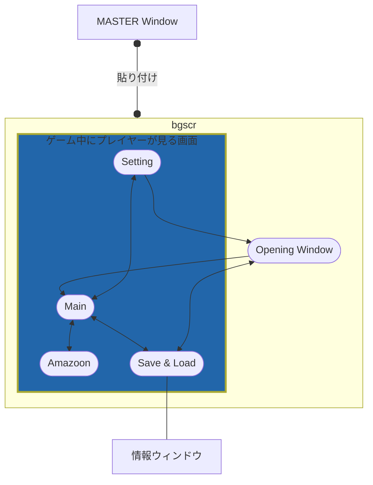

# PC Careing Diary
PC（自作パソコン）を作って育成していく育成･放置系ゲームです。色々制作中。
This is an idle desktop game where you build and upgrade your PC.
It's still under development.

個人制作であると同時に、リポジトリの練習も兼ねています。
In this repository, I practice the repository itself while publishing my personal work.
 

## 現在の仕様

画面遷移

## ファイルについて

スクリプトファイルの説明

 

* 00_module.hsp
	- ユーザー定義命令･関数、一部のWin32API定数のマクロ登録、その他外部から導入したモジュールなどをまとめたファイル.
 

* 01_variable.hsp
	- 以下のスクリプト内で使用するほぼ全ての変数をここで定義･管理しています.
	- また、ゲーム内で扱うアイテム類のデータをDBファイルから取り出す処理も行っています.
	- ウィンドウIDに関してはマクロ名定数列挙にてこちらで管理.
 

* 02_interface.hsp
	- ボタンやリストビュー、ハイパーリンクといったウィンドウオブジェクトをまとめています.
	- 同時に必要なウィンドウメッセージ、及び各種割り込み設定もこちらで扱っています.
 

* 03_process01.hsp
	- メインループの他、上記 02_interfaceからのルーチンジャンプ後の処理は原則全てこちらで扱っています.
 

* 04_process02.hsp
	- 描画に関するルーチンジャンプ処理のみこちらで管理しています.
	- また、SQLの処理部もこちらで扱う予定です.
 

* 05_experiment.hsp
	- 上記6つのスクリプトに変更を加える前にこちらで、加える変更箇所の動作確認や部分的な仮構築などを行います.
	- その他、思いつきや実験的な取り組みなどが中心でプロジェクトとはさほど関係ありません.
 

* 06, 07 拡張用のため欠番
 

* 08_myhelp.hs 別リポジトリへ
 

* 09_changelog.txt
	- 更新履歴です. ゲーム内で表示可能

以下略.

## その他

### 動作環境
* 動作には **WebView2Loader.dllが必要** です。**同梱しておりません**のでご了承ください。

### 使用言語 (Codeing Language)

- [Hot Soup Processor (HSP3)](https://hsp.tv/)
- [SQLite](https://www.sqlite.org)

### 開発環境 (Development Environment)
- Windows11 Pro 22H2 x64
- Visual Studio Code
- HSP3.7beta3

 

# Licence
 

* hsp37beta/common/
	* user32.as
	* gdi32.as
	* hsp3util.as
	* hspda.as
	* hsedsdk.as
<!--  -->
* hsprt
* hspcmp.dll
* hspda.dll

### Hot Soup Processor (HSP)
Copyright (C) 1997-2021, Onion Software/onitama, all rights reserved.
Made with base technology of OpenHSP.

### OpenHSP
Copyright (C) 1997-2021, Onion Software/onitama.
All rights reserved.

Redistribution and use in source and binary forms, with or without modification, are permitted provided that the following conditions are met:

Redistributions of source code must retain the above copyright notice, this list of conditions and the following disclaimer.

Redistributions in binary form must reproduce the above copyright notice, this list of conditions and the following disclaimer in the documentation and/or other materials provided with the distribution.

Neither the name of the Onion Software nor the names of its contributors may be used to endorse or promote products derived from this software without specific prior written permission.

THIS SOFTWARE IS PROVIDED BY THE COPYRIGHT HOLDERS AND CONTRIBUTORS "AS IS" AND ANY EXPRESS OR IMPLIED WARRANTIES, INCLUDING, BUT NOT LIMITED TO, THE IMPLIED WARRANTIES OF MERCHANTABILITY AND FITNESS FOR A PARTICULAR PURPOSE ARE DISCLAIMED. IN NO EVENT SHALL THE COPYRIGHT OWNER OR CONTRIBUTORS BE LIABLE FOR ANY DIRECT, INDIRECT, INCIDENTAL, SPECIAL, EXEMPLARY, OR CONSEQUENTIAL DAMAGES (INCLUDING, BUT NOT LIMITED TO, PROCUREMENT OF SUBSTITUTE GOODS OR SERVICES; LOSS OF USE, DATA, OR PROFITS; OR BUSINESS INTERRUPTION) HOWEVER CAUSED AND ON ANY THEORY OF LIABILITY, WHETHER IN CONTRACT, STRICT LIABILITY, OR TORT (INCLUDING NEGLIGENCE OR OTHERWISE) ARISING IN ANY WAY OUT OF THE USE OF THIS SOFTWARE, EVEN IF ADVISED OF THE POSSIBILITY OF SUCH DAMAGE.

ソースコード形式かバイナリ形式か、変更するかしないかを問わず、以下の条件を満たす場合に限り、再頒布および使用が許可されます。

ソースコードを再頒布する場合、上記の著作権表示、本条件一覧、および下記免責条項を含めること。
バイナリ形式で再頒布する場合、頒布物に付属のドキュメント等の資料に、上記の著作権表示、本条件一覧、および下記免責条項を含めること。
書面による特別の許可なしに、本ソフトウェアから派生した製品の宣伝または販売促進に、Onion Softwareの名前またはコントリビューターの名前を使用してはならない。

本ソフトウェアは、著作権者およびコントリビューターによって「現状のまま」提供されており、明示黙示を問わず、商業的な使用可能性、および特定の目的に対する適合性に関する暗黙の保証も含め、またそれに限定されない、いかなる保証もありません。著作権者もコントリビューターも、事由のいかんを問わず、 損害発生の原因いかんを問わず、かつ責任の根拠が契約であるか厳格責任であるか（過失その他の）不法行為であるかを問わず、仮にそのような損害が発生する可能性を知らされていたとしても、本ソフトウェアの使用によって発生した（代替品または代用サービスの調達、使用の喪失、データの喪失、利益の喪失、業務の中断も含め、またそれに限定されない）直接損害、間接損害、偶発的な損害、特別損害、懲罰的損害、または結果損害について、一切責任を負わないものとします。
***
 
 

* hsp37beta/common/
	* sqlele.hsp
* sqlite3.dll

## SQLite & SQlele
All of the code and documentation in SQLite has been dedicated to the public domain by the authors.

Anyone is free to copy, modify, publish, use, compile, sell, or distribute the original SQLite code, either in source code form or as a compiled binary, for any purpose, commercial or non-commercial, and by any means.

>*ソース、コード形式またはコンパイルされたバイナリとして、目的、商用または非商用、手段を問わず、誰でもオリジナルの SQLiteコードを自由にコピー、変更、公開、使用、コンパイル、販売、配布することができます。*

 

* [SQLite HP URL](https://www.sqlite.org)
SQLite はパブリックドメインです。

* [SQlele URL](http://spn.php.xdomain.jp/hsp_sqlele.htm)
SQlele はHSP3でSQLiteを扱えるようにするための支援モジュールです。

***
 
 

* hsp37beta/common/
	* 00_module.hsp
<!--  -->
* text/
	* 09_changelog.html
	* 05_ver000ex.txt
	* README.html
<!--  -->
* 01_variable.hsp
* 02_interface.hsp
* 03_process01.hsp
* 04_process02.hsp
* 05_experiment.hsp
* 05_ver016ex.exe
* PC Careing Diary.exe
* README.md

## MIT License
Copyright (c) 2022 YUZURANIUM

Permission is hereby granted, free of charge, to any person obtaining a copy
of this software and associated documentation files (the "Software"), to deal
in the Software without restriction, including without limitation the rights
to use, copy, modify, merge, publish, distribute, sublicense, and/or sell
copies of the Software, and to permit persons to whom the Software is
furnished to do so, subject to the following conditions:

The above copyright notice and this permission notice shall be included in all
copies or substantial portions of the Software.

THE SOFTWARE IS PROVIDED "AS IS", WITHOUT WARRANTY OF ANY KIND, EXPRESS OR
IMPLIED, INCLUDING BUT NOT LIMITED TO THE WARRANTIES OF MERCHANTABILITY,
FITNESS FOR A PARTICULAR PURPOSE AND NONINFRINGEMENT. IN NO EVENT SHALL THE
AUTHORS OR COPYRIGHT HOLDERS BE LIABLE FOR ANY CLAIM, DAMAGES OR OTHER
LIABILITY, WHETHER IN AN ACTION OF CONTRACT, TORT OR OTHERWISE, ARISING FROM,
OUT OF OR IN CONNECTION WITH THE SOFTWARE OR THE USE OR OTHER DEALINGS IN THE
SOFTWARE.

***
 
 

* hsp37beta/common/
	* webview2_10115038.hsp

# THANKS
webview2_10115038 はHSP3でWebView2を扱えるようにするための支援モジュールです。
* Author : eller
* [HSPメモ帳](https://blog.goo.ne.jp/hiro239415)

 
 

※随時追加予定